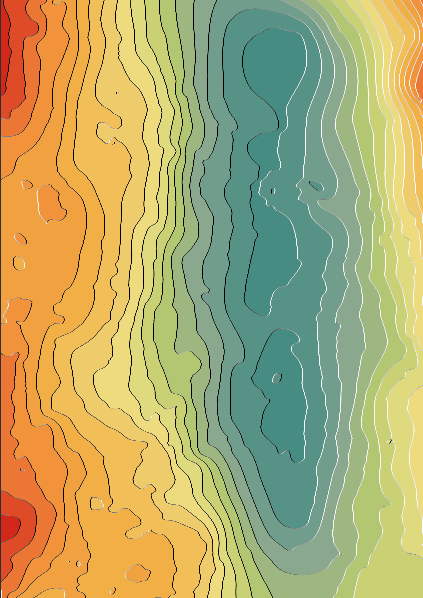

## Overview

Contour lines have become such a familiar part of our maps that their expressive power is often taken for granted. Modern GIS tools, for all their sophistication, can make contours feel purely functional — yet when handled with care, they remain one of the most visually striking ways to represent terrain.

This insight is hardly new. As early as the 19th century, cartographers experimented with shaded contour techniques to bring landscapes to life. The approach later became widely known as the *Tanaka method*, named after Japanese cartographer Kitiro Tanaka, whose work re-energised the technique. Even the cover of Imhof’s seminal cartographic text features a dramatic stack of shaded contour lines, a reminder of their enduring artistic and analytical potential.

In this project, I apply Tanaka-style illuminated contours to a subsurface seismic horizon from the Bowen Basin in Queensland, Australia. What is shown here is not topography, but a slice through deep time — a Triassic surface derived from seismic interpretation. By combining Python-based contour generation with cartographic refinement in ArcGIS Pro, the project explores how analytical workflows and visual design can work together to make abstract subsurface data more accessible and expressive.

---

## Visualisation

**This map was designed as a presentation and artistic piece — intentionally minimal, without labels, titles, or annotation — allowing form and illumination to carry the narrative.**

---

## Method

**Data**
- Subsurface seismic horizon (B85), Bowen Basin, Queensland  
- Interpreted Triassic surface represented as a raster

**Workflow**
1. Generate contour lines from the raster surface
2. Split contours at vertices to enable per-segment styling
3. Calculate additional attributes using Python:
   - Azimuth
   - Line width modifier
   - Colour modifier
4. Apply Tanaka-style illumination with lighting from the south-east
5. Refine symbology and layout within ArcGIS Pro

---

## Technical Notes

Contour segments were attributed using Python within ArcGIS Pro (arcpy and math libraries).  
Lighting effects were derived from segment azimuth, with values stored as 32-bit float fields to control both line width and tonal variation.

Separating contour generation, attribution, and cartographic styling allowed for experimentation while preserving a reproducible analytical workflow.

Source code and supporting material are available on request.
